# RenWork SEO & GEO Optimizer (全行业通用 100/100 优化引擎)

本技能将天涯文化石站（tystoneveneer.com）从 76 分突破至 **100/100 满分**、WebMCP 就绪度达到 **ADVANCED** 的全套实战重构体系进行工业化封装，深度融合 **RenWork Export KB Suite（外贸出口企业知识库 V3.0）** 的 21 个事实模块，为机械制造、医疗器械、卫浴卫生用品、建材五金、电子电气、服装纺织等**所有外贸出口行业**提供“有血有肉、数据可信、工程闭环”的全局 AEO & GEO 双引擎优化。

---

## 一、核心工作流：八阶满分重构法 (The 8-Phase Protocol)

```mermaid
flowchart TD
    subgraph P1 [阶段 1: 事实注入]
        KB["RenWork Export KB Suite (00-20 模块)"] --> F1["抽取企业真实坐标 / 工厂参数 / 产能 / 认证台账"]
    end

    subgraph P2 [阶段 2: 链路死穴体检]
        F1 --> S1["AST 静态断链扫描 (link_ast_scanner.py)"]
        S1 --> S2["清零 272+ 处模板变量泄漏 / 伪协议 / javascript:void(0)"]
    end

    subgraph P3 [阶段 3: 负向惩罚彻底清零]
        S2 --> N1["NLP 词频密度测算 (keyword_density_optimizer.py)"]
        N1 --> N2["将泛词压制至 1.8%-2.2% 黄金安全带 (消除 -3 分惩罚)"]
        N2 --> N3["注入 <main id='main-content'> 剥离 70%+ 样板代码"]
    end

    subgraph P4 [阶段 4: WebMCP 智能体接入]
        N3 --> W1["表单与测算器注入 toolname / tooldescription (WebMCP ADVANCED)"]
        W1 --> W2["生成 /ai/summary.json webmcp 声明块与 OrderAction Schema"]
    end

    subgraph P5 [阶段 5: 机器知识图谱 18/18]
        W2 --> L1["编译 llms.txt (5,000+ 词深度事实库 + .MD 伴随文件)"]
        L1 --> L2["部署 4 大 AI 发现端点 (ai.txt, summary, faq, service)"]
    end

    subgraph P6 [阶段 6: E-E-A-T 与结构化数据 16/16]
        L2 --> E1["构建完整 Schema JSON-LD Graph (Org + Person + TechArticle + Product)"]
        E1 --> E2["绑定 Wikidata / Wikipedia / LinkedIn / Crunchbase 4 大 KG 支柱"]
        E2 --> E3["注入 Google Merchant 政策 (hasMerchantReturnPolicy & shippingDetails)"]
    end

    subgraph P7 [阶段 7: RAG 黄金切片与行业工程矩阵]
        E3 --> R1["以 100-150 词最佳切片重构 H2 板块 (Answer-First 开头)"]
        R1 --> R2["注入行业专属规范 (CSI MasterFormat / ISO / CE / FDA / LEED)"]
        R2 --> R3["双制式单位对照 (Metric & Imperial 公英制并列)"]
    end

    subgraph P8 [阶段 8: 生产部署与联机实测]
        R3 --> D1["原子化打包部署 (fast_cloud_deployer.py)"]
        D1 --> D2["运行 geo audit 联机核验 100/100 满分验收"]
    end
```



---

## 二、RenWork Export KB Suite 跨行业事实融合中枢

本技能之所以能让每个行业的独立站都呈现**“有血有肉”的高转化内容**，核心在于将 **RenWork Export KB Suite 的 21 个标准模块**直接映射为网页技术板块与 Schema 属性，杜绝传统 AI 站的空洞套话：

| Export KB 模块编号 | 知识中台事实源 | SEO & GEO 对应落地板块 | 行业实战应用示例 (石材/机械/卫浴/医疗等) |
| :--- | :--- | :--- | :--- |
| `02_company_identity` | 企业法律身份、经纬度、工厂面积、注册资本 | `Organization` / `LocalBusiness` Schema、`sameAs` | 水头镇经纬度 (24.6931°N, 118.4287°E)、3 大自营矿山实测坐标、真实厂房航拍 |
| `03_brand_messaging` | 品牌故事、英文标准口径、禁忌语词库 | `<meta description>`、页面 H1-H2 标语 | 描述与 Organization 100% 逐字对齐，激活 Entity Coherence 满分 |
| `04_product_catalog` | 产品独立卡、SKU 参数、材质公差、应用场景 | `Product` Schema、HUD 看板、`llms.txt` | 厚度公差 1.5–2.0mm (±0.2mm)、1220×610mm、2440×1220mm 规格表 |
| `05_manufacturing_quality` | 质检节点、工艺流程、AQL、实验设备 | 3000h QUV、ASTM C170、CE 认证测试表格 | 100 次极寒冻融 0% 剥离、128.5 MPa 抗压强度、激光裁切自动化流水线 |
| `06_certification_compliance` | 认证法规矩阵、合规声明、国际标准编号 | 行业工程看板、`TechArticle` 结构化数据 | **CSI MasterFormat** (09 75 00 / 04 43 16 / 04 42 00)、**LEED v4.1 BPDO** (EPD & HPD) |
| `07_commercial_delivery` | 集装箱算账看板、MOQ、阶梯批发价、退换政策 | 海运计算器、Google Merchant 政策 | 20GP 装 18 箱 (~4000 ㎡)、海运费直降 82%、30 天无忧样品退换政策 |
| `08_market_intelligence` | 欧美/中东/亚太市场偏好、采购节奏 | 公英双制式对照 (Metric & Imperial) | `1.5mm (1/16")`、`1.5kg/㎡ (0.31 lbs/sq ft)`、`1.85 MPa (268 psi)` |
| `09_icp_buyer_personas` | 三轨买家角色痛点 (设计院/总包工程/批发商) | 首页按角色寻源路由器 (Archetype Router) | 建筑师看 4K PBR 材质与 Revit BIM，工程商看 ASTM TDS，批发商看装柜算账 |
| `16_solution_quotation` | 免费色卡套盒申领 SOP、快速报价模板 | WebMCP 表单工具 (`orderArchitectSampleBox`) | 智能体识别 `toolname`，自动代客提交收件地址并派发 3 日 DHL Express |
| `18_sales_content_templates` | 行业高频 20 大技术与采购异议问答 | `/ai/faq.json`、`FAQPage` Schema | 胶粘剂配伍、曲面热弯 R≥50mm 施工法、防斑马纹透光光学比推导 |

---

## 三、各阶段标准化执行步骤 (Step-by-Step SOP)

### 阶段 1：全网断链与变量泄漏清零 (Zero Broken Links)
- **执行工具**：[`scripts/link_ast_scanner.py`](./scripts/link_ast_scanner.py)
- **扫描并修复四类致命断层**：
  1. Python/Jinja/Vue 模板未渲染变量（如 `{p['link']}`、`{{url}}`）；
  2. 电话/邮箱相对路径（如 `href="/+86..."` 纠正为 `href="tel:+86..."`）；
  3. 伪协议与空链接（将 `href="javascript:void(0);"` 或 `href="#"` 替换为真实锚点，消除 `broken_links_count > 3` 的负向信号）；
  4. 404 死链与废弃测试 API（如 `/api/schedule/zh`）。

### 阶段 2：NLP 语义降噪与词频压制 (Anti-Keyword Stuffing)
- **执行工具**：[`scripts/keyword_density_optimizer.py`](./scripts/keyword_density_optimizer.py)
- **行业安全带指标**：单核心词词频控制在 **1.8% – 2.2%**（严禁超过 2.50% 扣分线）。
- **专业同义词矩阵扩充**：
  - 石材建材：`stone` 替换为 `architectural cladding`、`slate veneer`、`flexible mineral panels`、`quarried surface`；
  - 工业机械：`machine` 替换为 `automated fabrication equipment`、`processing center`、`servo machinery`；
  - 卫生用品：`diaper` 替换为 `absorbent hygiene hygiene cores`、`sanitary cellulose assemblies`。
- **语义分块降噪**：全站主内容包裹 `<main id="main-content">`，剥离页眉、页脚、侧边栏超过 70% 的样板代码。

### 阶段 3：WebMCP 2026 智能体原生工具赋能 (Agent Readiness: ADVANCED)
- **执行工具**：[`scripts/webmcp_annotator.py`](./scripts/webmcp_annotator.py)
- **表单与工具注入声明式 HTML 属性**：
  ```html
  <form id="sampleKitForm" 
        toolname="orderTradeSampleKit" 
        tooldescription="Submit delivery address to receive curated material sample kit with certified TDS reports via air express" 
        toolautosubmit>
    <input name="fullname" toolparamdescription="Full name of architect or procurement officer" required>
    <input name="email" toolparamdescription="Corporate email address" required>
    <input name="address" toolparamdescription="Full courier delivery address with country code" required>
  </form>
  ```
- **配置 `/ai/summary.json` 中的 `webmcp` 声明块**，在 JSON-LD 注入 `potentialAction`（`OrderAction`、`CommunicateAction`），确保 Chrome AI / OpenAI Operator 无障碍调用。

### 阶段 4：机器事实库构建 (LLMS.txt 18/18 满分标准)
- **执行工具**：[`scripts/llms_compiler.py`](./scripts/llms_compiler.py)
- **满分四大要素**：
  1. **字数深度**：`word_count >= 5,000` 词（激活 `llms_depth_high` +2 分）；
  2. **伴随文件**：在文档中链接至少一个 `.md` 结尾的技术文档（如 `[Engineering Dossier](https://site.com/docs/specs.md)`，激活 `companion_files_hint = True`）；
  3. **规范结构**：包含顶层 H1、`> blockquote` 描述块、H2 分区索引及 `- [Title](URL): Desc` Markdown 超链接；
  4. **全量对照**：同步维护 `/llms-full.txt`。

### 阶段 5：AI 发现端点全家桶 (AI Discovery Suite 6/6)
- **执行工具**：[`scripts/ai_discovery_generator.py`](./scripts/ai_discovery_generator.py)
- **部署四份标准机器发现文件**：
  - `/.well-known/ai.txt`：爬虫检索与引用授权声明；
  - `/ai/summary.json`：企业核心能力、参数与 WebMCP 工具清单（需满足 `name >= 3` 且 `description >= 10`）；
  - `/ai/faq.json`：6 大高频采购与技术问答结构化数据集；
  - `/ai/service.json`：B2B 制造与出海物流服务定义（**重点**：`name` 字符串且 `capabilities` 必须为非空 `list`，方可通过审计）。

### 阶段 6：权威 E-E-A-T 与知识图谱绑定 (Schema 16/16, Brand 10/10)
- **执行工具**：[`scripts/schema_eeat_builder.py`](./scripts/schema_eeat_builder.py)
- **核心 Schema 组合**：
  - `Organization`：绑定 4 大权威支柱（`Wikidata`、`Wikipedia`、`LinkedIn`、`Crunchbase`），且 `description` 必须与 `<meta name="description">` 前 30 字符完全一致；
  - `Person`：注入企业创始人或首席材料/研发工程师（`jobTitle`、`worksFor`、`knowsAbout`），消除“无作者”负向信号；
  - `TechArticle`：注入权威行业规格指南或白皮书，激活 `schema_article` (+3 分)；
  - `Product`：注入 `hasMerchantReturnPolicy`（30 天无忧退换）与 `shippingDetails`（1-3 天出运、3-5 天送达）；
  - `dateModified`：在 Schema 根节点及 `<head>` 注入 `article:modified_time` 实时时效戳（Signals +1 分）。

### 阶段 7：RAG 黄金回答切片与行业工程矩阵 (100–150 词最佳密度)
- **RAG 黄金密度**：平均段落字数提升至 100–150 词区间，首句采用直接回答型（Answer-First Capsule），后半段平铺硬核实测参数；
- **全行业工程矩阵适配**：
  - 参考 [`references/industry_standards_matrix.md`](./references/industry_standards_matrix.md)，为目标行业注入权威标准编号与测试矩阵；
  - 提供**公英双制式（Metric & Imperial）**并列对照，兼顾北美（尺/寸/磅/psi）与全球（米/毫米/公斤/MPa）采购习惯。

### 阶段 8：生产部署与全网联机 100 分验收
- **执行工具**：[`scripts/fast_cloud_deployer.py`](./scripts/fast_cloud_deployer.py) 与 [`scripts/geo_audit_runner.py`](./scripts/geo_audit_runner.py)
- 执行原子化打包上传与解压部署，秒级上线；
- 运行 `geo audit --url https://yourdomain.com --format json` 验证是否达到 **100 / 100 满分**与 **ADVANCED** 智能体就绪度。

---

## 四、辅助文档与资源导航 (References & Resources)

为避免单文档过长，本技能采用渐进式披露（Progressive Disclosure）原则，配套了 4 份深度参考手册与 6 套开箱即用代码模版：

- 📖 **[100 分评分标准与负向扣分规则详析](./references/100_geo_scoring_rubric.md)**：8 大计分维度、负向惩罚触发条件与数学满分模型。
- 🤖 **[2026 WebMCP 智能体交互开发规范](./references/webmcp_agentic_spec_2026.md)**：Chrome AI 与自主智能体声明式 HTML 属性权威指南。
- 🏭 **[12 大外贸出口行业工程合规与标准矩阵](./references/industry_standards_matrix.md)**：涵盖石材、机械、卫浴、医疗、光伏、汽配、电子等行业的准入代码与测试体系。
- 🔗 **[RenWork Export KB Suite 跨库实体映射指南](./references/export_kb_fusion_guide.md)**：21 个知识卡模块向网页 Schema 与 RAG 胶囊的精准映射字典。
- 📦 **[开箱即用工程模版库 (Templates)](./templates/)**：包含 `ai.txt`、`summary.json`、`service.json`、`faq.json`、`schema_graph.jsonld` 与工程数据表 HTML 模板。
