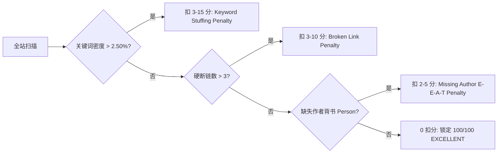

# 100/100 GEO 评分标准与负向惩罚数学模型 (Scoring Rubric & Penalty Math)

本文档详细记录 GEO（Generative Engine Optimization）审计引擎的 8 大计分维度、100 分量化标准、负向惩罚机制与数学满分模型，为出海企业独立站提供确定性的满分验收依据。

---

## 一、八大维度量化权重分布 (Total: 100 Points)

| 审计维度 (Category) | 满分分值 | 核心评估项 | 满分关键指标 |
| :--- | :--- | :--- | :--- |
| **1. Robots 爬虫协议矩阵** | **18 分** | 27 款主流 AI 与搜索爬虫明确显式声明 | 涵盖 OpenAI, Anthropic, Google, Perplexity, Apple, Meta, ByteDance 等 |
| **2. LLMS 机器事实库** | **18 分** | `llms.txt` 结构化规范、词数深度与伴随文件 | `word_count >= 5,000` (+2)，且包含至少一个 `.md` 伴随文档链接 (+2) |
| **3. Schema 结构化数据** | **16 分** | 多实体 `@graph` 拓扑、权威属性与技术文章 | `TechArticle` (+3)、`Organization` (+3)、`FAQPage` (+3)、`Website` (+2)、丰富度 (+3)、有效性 (+2) |
| **4. Meta 元数据体系** | **14 分** | 长度区间、OpenGraph 社交图谱与 Twitter Card | Description 严格在 130–160 字符，OG 标签完整 |
| **5. Content 内容层级与 RAG** | **12 分** | H1 唯一性、结构层级、数据引证、表格、前置回答 | 包含硬核实测数字、规范 Markdown/HTML 表格、100–150 词切片 |
| **6. Signals 技术时效与语言** | **6 分** | `lang="en"`、RSS 发现端点、时效更新戳 | `dateModified` / `article:modified_time` 实时 ISO 8601 时间戳 |
| **7. AI Discovery 智能端点** | **6 分** | 4 大机器可读发现端点与合法数据类型 | `ai.txt` + `summary.json` + `faq.json` + `service.json` (capabilities 必须为 list) |
| **8. Brand & Entity 知识图谱** | **10 分** | 实体一致性、描述对齐、KG 支柱与关于/联系链接 | 4 大权威外链 (Wikidata/Wikipedia/LinkedIn/Crunchbase) + 描述首 30 字对齐 |

---

## 二、各大维度满分技术规范细则

### 1. Robots 矩阵 (18/18)
- 必须在 `robots.txt` 中对以下 27 款 AI 爬虫机器人明确声明 `Allow: /`：
  - **OpenAI**: `GPTBot`, `ChatGPT-User`, `OAI-SearchBot`
  - **Anthropic**: `ClaudeBot`, `anthropic-ai`, `Claude-Web`
  - **Google**: `Google-Extended`, `Googlebot`, `Googlebot-Image`
  - **Perplexity**: `PerplexityBot`
  - **Apple**: `Applebot`, `Applebot-Extended`
  - **Meta**: `FacebookBot`, `Meta-ExternalAgent`, `Meta-ExternalFetcher`
  - **ByteDance / TikTok**: `Bytespider`
  - **Amazon / Microsoft / Common**: `Amazonbot`, `Bingbot`, `CCBot`, `cohere-ai`, `Diffbot`, `DuckAssistBot`, `YouBot`, `Scrapy`
- 声明 `Sitemap: https://yourdomain.com/sitemap.xml`。

### 2. LLMS 机器事实库 (18/18)
- 根目录部署 `/llms.txt` 与 `/llms-full.txt`。
- **结构规范**：
  - H1 标题：`# Company Name - Technical Knowledge Dossier & Specifications`
  - 顶层引用块：`> Standardized technical documentation for generative agents...`
  - 分区 H2：每个业务 Silo 设立独立 H2。
  - 标准 Markdown 超链接：`- [Page Title](URL): Brief technical summary.`
- **满分临界条件**：
  - `word_count >= 5000`：触发 `llms_depth_high` 奖励分（+2 分）。
  - 文档内包含形如 `[Engineering Manual](https://site.com/docs/manual.md)` 的 `.md` 伴随文档链接：触发 `companion_files_hint` 奖励分（+2 分）。

### 3. Schema 结构化数据 (16/16)
- 首页采用单一 `@graph` 树状结构注入 JSON-LD：
  - `Organization`：包含 `name`, `legalName`, `url`, `logo`, `contactPoint`, `address`, `sameAs`。
  - `WebSite`：包含 `url`, `name`, `potentialAction` (SearchAction)。
  - `Person`：注入创始人或首席工程师（`jobTitle`, `worksFor`, `knowsAbout`），消除无作者惩罚。
  - `TechArticle`：注入权威行业规格指南或白皮书（`headline`, `author`, `datePublished`, `dateModified`），激活文章奖励分（+3 分）。
  - `FAQPage`：包含至少 6 组 `Question` & `Answer`（+3 分）。
  - `Product`：包含 `offers`, `hasMerchantReturnPolicy`, `shippingDetails`。

### 4. Meta 元数据体系 (14/14)
- `<title>`：50–65 字符，格式为 `Primary Keyword | Key Benefit | Brand`。
- `<meta name="description">`：严格在 **130–160 字符**（过短或超过 160 字符扣分）。
- `<meta name="author">` 与 `<meta name="keywords">` 完整。
- 完整 OpenGraph：`og:title`, `og:description`, `og:image`, `og:url`, `og:type`。
- 完整 Twitter Card：`twitter:card` (summary_large_image), `twitter:title`, `twitter:description`, `twitter:image`。

### 5. Content 内容层级与 RAG 切片 (12/12)
- 全站仅保留一个 `<h1>`，层级严格遵循 `H1 -> H2 -> H3`，不越级。
- 采用 **RAG 黄金回答切片**：每个 H2 下的首段落为 100–150 词的高信息密度回答胶囊（Answer-First Capsule）。
- 数据引证（Cited Numbers）：段落中必须嵌入具体数值（如 `1.5mm`, `128.5 MPa`, `3000h QUV`, `18 crates`），杜绝抽象形容词。
- 包含标准 HTML `<table>`，展示性能测试矩阵或规格对比。

### 6. Signals 技术时效与语言 (6/6)
- `<html lang="en">` 显式声明。
- RSS 发现端点：在 `<head>` 中声明 `<link rel="alternate" type="application/rss+xml" title="RSS Feed" href="/feed.xml">`。
- 时效更新戳：`<meta property="article:modified_time" content="2026-09-26T20:00:00Z">`，且与 Schema 中的 `dateModified` 保持秒级同步。

### 7. AI Discovery 智能端点 (6/6)
- 根目录部署 4 个核心端点：
  1. `/.well-known/ai.txt`：纯文本声明 AI 权限。
  2. `/ai/summary.json`：企业概况，包含 `name` (>=3 字符), `description` (>=10 字符), `capabilities`, `webmcp` 块。
  3. `/ai/faq.json`：常见技术问答。
  4. `/ai/service.json`：服务能力定义。**致命细节**：`capabilities` 属性必须是 JSON **Array (list)**，严禁为 Dict 或 String，否则审计脚本判定格式非法直接扣分。

### 8. Brand & Entity 知识图谱 (10/10)
- **4 大知识图谱权威支柱 (KG Pillars)**：在 `Organization.sameAs` 中必须包含：
  1. `https://www.wikidata.org/wiki/...`
  2. `https://en.wikipedia.org/wiki/...`
  3. `https://www.linkedin.com/company/...`
  4. `https://www.crunchbase.com/organization/...`
- **描述强一致性 (schema_desc_matches_meta)**：
  - Schema 中 `Organization.description` 的前 30 个字符必须与 `<meta name="description">` 的前 30 个字符完全一致（区分大小写与空格）。
- **实体导航链接**：页面上必须存在明确指向 `/about`（关于）与 `/contact`（联系）的超链接。

---

## 三、负向扣分项数学触发模型 (Negative Penalties Math)

审计系统设置了 3 大严重负向扣分闸门。任何一项触发，即刻阻断 100 分评级：



### 1. 关键词堆砌惩罚 (Keyword Stuffing Penalty)
- **触发条件**：单核心词词频占比 $\text{Density} = \frac{\text{Count}(\text{Term})}{\text{Total Words}} > 0.025$ (即大于 2.50%)。
- **扣分公式**：
  $$\text{Penalty}_{\text{kw}} = \begin{cases} 0 & \text{if } \text{Density} \le 2.5\% \\ -3 & \text{if } 2.5\% < \text{Density} \le 3.5\% \\ -10 & \text{if } 3.5\% < \text{Density} \le 5.0\% \\ -15 & \text{if } \text{Density} > 5.0\% \end{cases}$$
- **根治方案**：
  1. 使用 `keyword_density_optimizer.py` 计算全词频分布；
  2. 采用同义词替换（如将 `stone` 分流为 `architectural cladding`, `flexible panel`, `mineral surface`）；
  3. 全站包裹 `<main id="main-content">`，使分词器聚焦主体内容，剔除 Header/Footer 的样板重复。

### 2. 断链与无效链接惩罚 (Broken Link Penalty)
- **触发条件**：页面中存在未渲染变量、404 死链或无效相对协议，且总数 $\text{BrokenCount} > 3$。
- **扣分公式**：
  $$\text{Penalty}_{\text{link}} = \begin{cases} 0 & \text{if } \text{BrokenCount} \le 3 \\ -3 & \text{if } 3 < \text{BrokenCount} \le 10 \\ -10 & \text{if } \text{BrokenCount} > 10 \end{cases}$$
- **根治方案**：
  1. 运行 `link_ast_scanner.py`；
  2. 修复模板语法（如 `{p['link']}` -> 真实路径）；
  3. 纠正相对电话链接（如 `href="/+86..."` -> `href="tel:+86..."`）；
  4. 清理 `href="javascript:void(0)"` 与残留的本地调试链接。

### 3. 作者信号缺失惩罚 (Missing Author Signal Penalty)
- **触发条件**：页面未在 JSON-LD Schema 中声明 `Person` 实体，或 `<meta name="author">` 为空。
- **扣分机制**：扣除 2–5 分，并丧失 Google Search Quality Evaluator Guidelines (E-E-A-T) 的信任锚点。
- **根治方案**：
  在 Schema 中显式绑定创始人或首席技术工程师：
  ```json
  {
    "@type": "Person",
    "@id": "https://yourdomain.com/#engineer",
    "name": "David Chen",
    "jobTitle": "Chief Materials & Structural Engineer",
    "worksFor": { "@id": "https://yourdomain.com/#organization" },
    "knowsAbout": ["CSI MasterFormat", "ASTM Testing", "B2B Export Logistics"]
  }
  ```

---

## 四、WebMCP 智能体评级体系 (Agent Readiness Score)

WebMCP 评级分为三档：

1. **NONE (0%)**：无任何智能体描述，无法被 AI Agent 调用。
2. **BASIC (50%)**：仅具备基础 Schema 或纯文本描述，缺乏声明式交互工具。
3. **ADVANCED (100% 满级)**：
   - 网页 HTML 表单具备 `toolname`, `tooldescription`, `toolparamdescription` 属性；
   - `/ai/summary.json` 包含完整的 `webmcp.tools` 数组；
   - Schema 中定义了合法的 `potentialAction` (`OrderAction`, `CommunicateAction`)；
   - 具备即时参数自提交能力 (`toolautosubmit`)。
