# RenWork Export KB Suite 跨库实体映射指南 (Export KB Fusion Guide)

本文档定义如何将 **RenWork Export KB Suite（外贸出口企业知识库 V3.0）** 的 21 个标准模块（00–20）无缝提取并注入独立站的技术架构、Schema 结构化数据、WebMCP 智能体工具与 RAG 黄金回答切片中，实现出海企业独立站由内而外的“事实锁定”与“血肉丰满”。

---

## 一、知识中台 21 模块与独立站技术架构全景映射

```mermaid
graph TD
    subgraph KB [RenWork Export KB Suite 21 模块]
        KB00["00 事实总览与锁定"]
        KB01["01 行业分类与 HS"]
        KB02["02 企业法律与地理实体"]
        KB03["03 品牌标准口径与禁忌"]
        KB04["04 产品规格与 SKU 矩阵"]
        KB05["05 制造工艺与实验室实测"]
        KB06["06 国际法规与认证证书"]
        KB07["07 商务交付与海运集装箱"]
        KB08["08 市场洞察与公英制对照"]
        KB09["09 ICP 买家画像路由器"]
        KB10["10 海关提单与真实运量"]
        KB13["13 标杆工程与落地案例"]
        KB16["16 快速报价与样品套盒 SOP"]
        KB17["17 阶梯批发与采购让步"]
        KB18["18 销售异议与高频技术 FAQ"]
        KB20["20 质量治理与审计闸门"]
    end

    subgraph Site [独立站 SEO & GEO 落地层]
        L_ROBOTS["robots.txt & canonical"]
        L_SILO["Silo Hub 分类层级"]
        L_ORG["Organization Schema & sameAs"]
        L_META["Meta Description 130-160 字"]
        L_PROD["Product Schema & HUD 参数"]
        L_TEST["ASTM / ISO 性能测试表格"]
        L_TECH["TechArticle Schema & CSI 规范"]
        L_CALC["海运装柜计算器 & MerchantPolicy"]
        L_UNITS["公英双制式并列显示"]
        L_ROUTER["三轨买家寻源路由器"]
        L_PROOF["出货港口与年运量勋章"]
        L_CASE["Case Studies 实景工程案例"]
        L_MCP["WebMCP 智能体样品申领表单"]
        L_TIER["B2B 阶梯批发报价矩阵"]
        L_FAQ["/ai/faq.json & FAQPage Schema"]
        L_GATE["100/100 联机自动化审计闸门"]
    end

    KB00 --> L_ROBOTS
    KB01 --> L_SILO
    KB02 --> L_ORG
    KB03 --> L_META
    KB04 --> L_PROD
    KB05 --> L_TEST
    KB06 --> L_TECH
    KB07 --> L_CALC
    KB08 --> L_UNITS
    KB09 --> L_ROUTER
    KB10 --> L_PROOF
    KB13 --> L_CASE
    KB16 --> L_MCP
    KB17 --> L_TIER
    KB18 --> L_FAQ
    KB20 --> L_GATE
```

---

## 二、21 个模块的字段级抽取与注入规则 (Field-Level Ingestion Rules)

### 模块 00：事实总览与锁定 (`00_overview_fact_lock`)
- **抽取内容**：企业唯一官方英文名、主营品类英文标准称谓、生产基地坐标、官网主域名。
- **落地板块**：全站 `<title>` 品牌后缀、`canonical` 规范 URL、根路径 `robots.txt` 与 `sitemap.xml`。
- **防伪规则**：全站禁止出现未经核准的别名或拼写变体。

### 模块 01：行业分类与 HS 编码 (`01_industry_product_scope`)
- **抽取内容**：全球 HS Code 6 位代码（如 `6802.99`, `8479.89`, `9619.00`）、顶级类目树与子类目映射。
- **落地板块**：全站 4 大 Silo 导航结构、面包屑导航（`BreadcrumbList` Schema）、URL 静态层级路径。

### 模块 02：企业法律与地理实体 (`02_company_identity`)
- **抽取内容**：工商注册法定英文全称、实体厂址精确经纬度（纬度/经度）、厂房占地面积、统一社会信用代码。
- **落地板块**：
  - `Organization` Schema 与 `LocalBusiness` Schema。
  - `geo: GeoCoordinates` 经纬度注入（如石材基地水头镇：`latitude: 24.6931`, `longitude: 118.4287`）。
  - `sameAs` 数组绑定 4 大权威知识图谱支柱：Wikidata, Wikipedia, LinkedIn, Crunchbase。

### 模块 03：品牌标准口径与禁忌语 (`03_brand_messaging`)
- **抽取内容**：企业核心价值主张（Value Proposition）、130–160 字符标准英文简介、全站禁忌语词库。
- **落地板块**：
  - `<meta name="description">`：严格截取 130–160 字符。
  - `Organization.description`：前 30 个字符必须与 `<meta name="description">` **逐字 100% 对齐**，触发 `schema_desc_matches_meta` 满分。
  - 执行禁忌语过滤：全面剔除 "revolutionary", "best", "cheap" 等低信任度空洞词。

### 模块 04：产品规格与 SKU 矩阵 (`04_product_catalog`)
- **抽取内容**：各 SKU 标准型号、物理尺寸、厚度公差（±0.2mm）、材质成分比例、应用场景分类。
- **落地板块**：
  - 页面产品卡片 HUD 参数看板；
  - `Product` Schema（包含 `sku`, `mpn`, `material`, `weight`, `offers`）；
  - 编译入 `/llms.txt` 的 SKU 事实索引区。

### 模块 05：制造工艺与实验室实测 (`05_manufacturing_quality`)
- **抽取内容**：QC 检验流程（IQC/IPQC/FQC）、核心实验室第三方检测数据（抗压强度、抗折弯曲、3000h 耐候加速老化、吸水率、耐化学腐蚀等）。
- **落地板块**：
  - 网页 HTML `<table>` 硬核实测性能对比表；
  - RAG 黄金回答切片（首段明确包含 `128.5 MPa`, `3000h QUV`, `0% delamination` 等具体数值，满足 GEO 数据引证要求）。

### 模块 06：国际法规与认证证书 (`06_certification_compliance`)
- **抽取内容**：CSI MasterFormat 分类编号、CE 证书编号、ASTM 试验代号、FDA 注册号、ISO 9001/14001 证书扫描件与 LEED EPD/HPD 声明。
- **落地板块**：
  - 页面权威认证勋章栏目；
  - 注入 `TechArticle` Schema（以行业工程规范或白皮书为载体，声明 `headline`, `author`, `publisher`，激活 +3 分）。

### 模块 07：商务交付与海运集装箱 (`07_commercial_delivery`)
- **抽取内容**：起运港（如 Xiamen Port）、包装木箱规格、20GP / 40HQ 最大装柜平米数/吨数、出运交期（3–7 天）、退换货政策。
- **落地板块**：
  - 海运集装箱计算器交互小部件；
  - `hasMerchantReturnPolicy` Schema（30 天无忧样品退换、全额退款、买家免承担退货运费）；
  - `shippingDetails` Schema（运送至全球 220+ 国家，海运 15–25 天，空运 3–5 天）。

### 模块 08：市场洞察与公英制对照 (`08_market_intelligence`)
- **抽取内容**：北美客户偏好的英制单位（inch, lbs, psi, sq ft）与欧洲/亚洲客户偏好的公制单位（mm, kg, MPa, sqm）换算规则。
- **落地板块**：
  - 全站参数排版严格采用双制式并列：`1.5–2.0 mm (1/16" – 5/64")`、`1.5 kg/m² (0.31 lbs/sq ft)`；
  - 消除跨国买家阅读心智摩擦，增强大模型向多国用户输出时的适应性。

### 模块 09：ICP 买家画像路由器 (`09_icp_buyer_personas`)
- **抽取内容**：三轨买家细分画像与核心痛点（建筑师/室内设计师看审美与 BIM 材质包；工程总包看防火认证与 ASTM 报告；建材批发商看木箱装柜与海运降本）。
- **落地板块**：
  - 首页 Hero 区域下方的 **Archetype Persona Router**；
  - 一键切换角色视角，分别引导至 3D 材质下载、工程合规包、或集装箱算账看板。

### 模块 10：海关提单与真实运量 (`10_customs_buyer_signals`)
- **抽取内容**：近 180 天真实海关出运货柜量（TEU）、年产值、主要出口目的港口（Long Beach, Rotterdam, Jebel Ali）。
- **落地板块**：
  - 页面 Trust Bar 真实交付量勋章（如 `Annual Capacity: 1,500,000+ sqm | Shipped to 68 Countries`）；
  - 强化大模型抓取时的企业真实规模背书（Real Operational Traction）。

### 模块 13：标杆工程与落地案例 (`13_target_account_research`)
- **抽取内容**：五星级酒店、高端商业中心、豪宅别墅等真实完工工程项目实拍、选用 SKU 及施工技法。
- **落地板块**：
  - Project Portfolio / Case Studies 真实图文板块；
  - 结构化打标项目年份、所在城市及建筑师事务所名称。

### 模块 16：快速报价与样品套盒 SOP (`16_solution_quotation`)
- **抽取内容**：样板箱规格（如 24 块精选天然石皮 + 完整 TDS 技术报告）、申领流程、DHL 快递派发时效。
- **落地板块**：
  - 声明式 WebMCP 表单（`toolname="orderArchitectSampleBox"`）；
  - 智能体直接代客提交收货地址并调取 API 派单。

### 模块 17：阶梯批发与采购让步 (`17_manage_quote_sample_negotiation`)
- **抽取内容**：MOQ 门槛、阶梯订货量价格折让区间（100 ㎡ / 500 ㎡ / 2000 ㎡+）、信用条款。
- **落地板块**：
  - B2B 阶梯采购价格透明展示看板；
  - 满足 Google Merchant B2B 批发政策与大模型商机评估推荐。

### 模块 18：销售异议与高频技术 FAQ (`18_sales_content_templates`)
- **抽取内容**：海外客户在材质配伍、粘结胶水、耐候冻融、曲面热弯、海运防潮等维度的 20 大技术与采购异议标准解答。
- **落地板块**：
  - 部署 `/ai/faq.json` 机器可读文件；
  - 页面 FAQ 交互式手风琴折叠面板；
  - 注入标准 `FAQPage` Schema（至少 6 组 Q&A，获得 Schema +3 分）。

### 模块 20：质量治理与审计闸门 (`20_governance_audit_gate`)
- **抽取内容**：断链审计标准、NLP 词频阈值（<=2.2%）、Schema 校验脚本。
- **落地板块**：
  - 运行 `link_ast_scanner.py`、`keyword_density_optimizer.py` 与 `geo audit`；
  - 形成持续集成（CI/CD）上线前自动化验收，确保 100/100 零扣分状态永不回退。

---

## 三、AI Agent 跨行业构建工作流示范 (Prompting Pattern)

当使用本技能对任何新出海行业独立站进行优化时，Agent 遵循以下执行范式：

1. **输入阶段**：读取该企业的 `renwork-export-kb-suite` 知识库目录（或导入企业产品手册与参数表）；
2. **提取阶段**：依据上述映射表，自动提取 21 个维度的真实事实，填充至 `scripts/schema_eeat_builder.py` 与 `scripts/ai_discovery_generator.py`；
3. **清洗阶段**：运行 `scripts/link_ast_scanner.py` 扫除断链与模板变量泄漏；
4. **编译阶段**：编译生成包含 5,000+ 词事实的 `/llms.txt` 及 4 大 AI 发现端点；
5. **验收阶段**：联机运行 `geo audit`，直接交付 100/100 满分且具 ADVANCED 智能体就绪度的企业出海门户。
