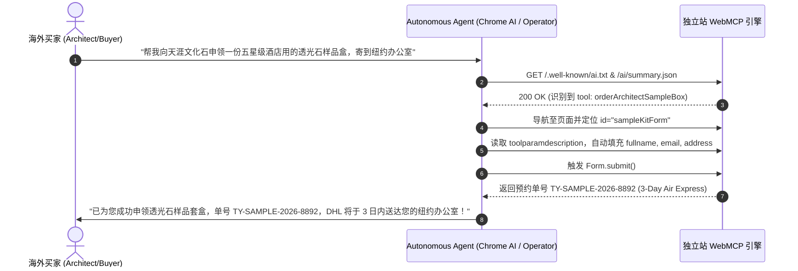

# 2026 WebMCP 智能体原生交互开发规范 (Declarative WebMCP Specification)

随着 Chrome Built-in AI、OpenAI Operator、Perplexity Computer Use 等自主智能体（Autonomous Agents）成为新一代互联网流量入口，传统外贸独立站正在经历从“被动检索”到“主动调用”的代际跃迁。

**WebMCP (Web Model Context Protocol)** 是 2026 年自主智能体直接理解网页功能、调用业务工具并代客执行采购任务的声明式交互协议。

---

## 一、WebMCP 架构三支柱

```mermaid
flowchart TD
    subgraph Layer1 [1. 发现层: Discovery Layer]
        A["/ai/summary.json"] -->|声明 webmcp.tools 工具清单| B[智能体感知]
    end

    subgraph Layer2 [2. 语义层: Semantic Layer]
        C["Schema JSON-LD"] -->|声明 potentialAction (Order/Communicate)| B
    end

    subgraph Layer3 [3. DOM 执行层: Execution Layer]
        D["HTML Form & Inputs"] -->|注入 toolname / tooldescription / toolparamdescription| E[智能体自动化填充与提交]
    end

    B --> E
```

---

## 二、HTML DOM 声明式属性规范

智能体在解析 DOM 树时，会优先抓取包含 `tool*` 前缀的语义属性。任何交互表单（申领样品、询价、集装箱测算）均需注入以下属性：

### 1. 表单级属性 (`<form>`)
- `toolname` (必须)：工具的英文驼峰标识符（如 `orderArchitectSampleBox`, `calculateOceanFreight`）。
- `tooldescription` (必须)：面向大模型的工具功能描述，必须清晰说明前置条件、执行逻辑与最终产出。
- `toolautosubmit` (可选)：若为布尔属性，指示智能体填齐必填字段后可直接模拟 `submit` 事件。

### 2. 字段级属性 (`<input>`, `<select>`, `<textarea>`)
- `toolparamdescription` (必须)：参数语义描述，告知大模型该字段期望的格式、国际规范或单位（例如："Corporate business email, personal Gmail discouraged", "ISO country code e.g. US, DE, AE"）。
- `<label for="...">` (必须)：每个输入控件必须严格配对 `<label>`，强化 OCR 与无障碍树（Accessibility Tree）双重解析能力。

### 3. 代码示范：样品套盒申领表单
```html
<form id="sampleKitForm" 
      action="/api/request-samples" 
      method="POST"
      toolname="orderArchitectSampleBox" 
      tooldescription="Submit delivery address to receive curated architectural sample kit with certified TDS reports via DHL Express" 
      toolautosubmit>
  
  <div class="form-group">
    <label for="fullName">Full Name</label>
    <input type="text" id="fullName" name="fullname" 
           toolparamdescription="Full legal name of the architect, interior designer, or procurement officer" 
           required placeholder="e.g. Sarah Jenkins">
  </div>

  <div class="form-group">
    <label for="corpEmail">Corporate Email</label>
    <input type="email" id="corpEmail" name="email" 
           toolparamdescription="Corporate email address for dispatch notification and tracking number" 
           required placeholder="name@firm.com">
  </div>

  <div class="form-group">
    <label for="projectType">Application Sector</label>
    <select id="projectType" name="project_type" 
            toolparamdescription="Target project category for tailored sample curation">
      <option value="commercial_facade">Commercial Exterior Facade</option>
      <option value="luxury_hospitality">Luxury Hospitality & Casino Interior</option>
      <option value="residential_feature">High-end Residential Feature Wall</option>
      <option value="curved_column">Curved Column & Backlit Installation</option>
    </select>
  </div>

  <div class="form-group">
    <label for="deliveryAddress">Courier Delivery Address</label>
    <textarea id="deliveryAddress" name="address" rows="3" 
              toolparamdescription="Full street delivery address including city, state, postal code, and country for DHL air parcel" 
              required placeholder="Suite 400, 100 Architecture Way, New York, NY 10001, USA"></textarea>
  </div>

  <button type="submit" id="btnSubmitSample">Request Free Curation Kit (3-Day Air Express)</button>
</form>
```

---

## 三、`/ai/summary.json` 中的 WebMCP 声明块

在网站根目录的 `/ai/summary.json` 中，必须包含合法的 `webmcp` 节点，以便 LLM 在第一轮爬取时即构建工具集（Function Calling Schema）：

```json
{
  "name": "Tianya Stone B2B Portal",
  "version": "2026.1",
  "description": "Manufacturer and exporter of ultra-thin flexible stone veneers, translucent panels, and MCM architectural sheets.",
  "webmcp": {
    "available": true,
    "version": "2026.1",
    "endpoint": "/ai/summary.json",
    "tools": [
      {
        "name": "orderArchitectSampleBox",
        "description": "Submit delivery address to receive curated material sample kit with certified TDS reports via DHL Express.",
        "parameters": {
          "type": "object",
          "properties": {
            "fullname": { "type": "string", "description": "Full name of recipient" },
            "email": { "type": "string", "description": "Corporate business email" },
            "project_type": { "type": "string", "enum": ["commercial_facade", "luxury_hospitality", "residential_feature", "curved_column"] },
            "address": { "type": "string", "description": "Full international courier address" }
          },
          "required": ["fullname", "email", "address"]
        },
        "target_form_id": "sampleKitForm"
      },
      {
        "name": "calculateContainerCrates",
        "description": "Calculates optimal wooden crate packaging and container loading capacity for 20GP or 40HQ ocean freight.",
        "parameters": {
          "type": "object",
          "properties": {
            "square_meters": { "type": "number", "description": "Total area in square meters (sqm)" },
            "thickness_mm": { "type": "number", "enum": [1.5, 2.0, 3.0], "description": "Panel thickness" }
          },
          "required": ["square_meters"]
        },
        "target_form_id": "freightCalculatorForm"
      }
    ]
  }
}
```

---

## 四、Schema JSON-LD 智能体动作绑定 (`potentialAction`)

在首页的 `Organization` 或 `WebSite` Schema 中，注入 Schema.org 标准的 `potentialAction`，将 WebMCP 工具映射到全网公认的动作本体中：

```json
{
  "@context": "https://schema.org",
  "@graph": [
    {
      "@type": "Organization",
      "@id": "https://yourdomain.com/#organization",
      "name": "Tianya Flexible Stone Veneer Co., Ltd.",
      "url": "https://yourdomain.com",
      "potentialAction": [
        {
          "@type": "OrderAction",
          "name": "Request Architectural Sample Box",
          "target": {
            "@type": "EntryPoint",
            "urlTemplate": "https://yourdomain.com/#sample-kit",
            "inLanguage": "en-US",
            "actionPlatform": [
              "http://schema.org/DesktopWebPlatform",
              "http://schema.org/MobileWebPlatform",
              "https://schema.org/WebMCP"
            ]
          },
          "result": {
            "@type": "ParcelDelivery",
            "deliveryMethod": "http://purl.org/goodrelations/v1#DeliveryModeDirectDownload",
            "trackingNumber": "DHL Express"
          }
        },
        {
          "@type": "CommunicateAction",
          "name": "Instant WhatsApp Technical Consultation",
          "target": "https://wa.me/8618960366169?text=Inquiry%20from%20Agent"
        }
      ]
    }
  ]
}
```

---

## 五、主流自主智能体调用流程图


